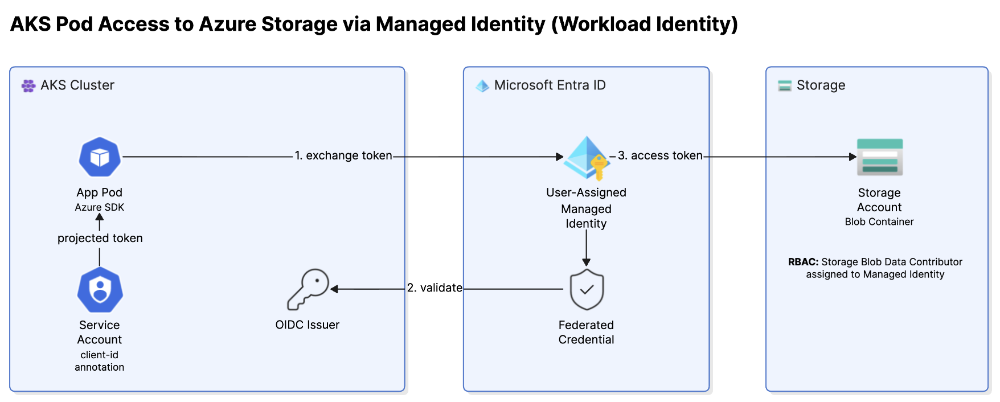

# Lab 4 — Access Storage Account via Managed Identity · 20 minutes



## 1. Create Storage account

```bash
export STORAGE_ACCOUNT_NAME="YOUR_STORAGE_ACCOUNT_NAME"
```
```bash
az storage account create \
  --name $STORAGE_ACCOUNT_NAME \
  --resource-group $RG \
  --location southeastasia \
  --sku Standard_LRS

az storage container create \
  --name lab-data \
  --account-name $STORAGE_ACCOUNT_NAME \
  --auth-mode login
  ```
---
## 2. Assige Identiy
```bash
# Storage Blob Data Reader
PRINCIPAL_ID=$(az identity show -g $RG -n $IDENTITY_NAME --query principalId -o tsv

az role assignment create \
  --role "Storage Blob Data Reader" \
  --assignee $PRINCIPAL_ID \
  --scope "/subscriptions/$SUBSCRIPTION_ID/resourceGroups/$RG/providers/Microsoft.Storage/storageAccounts/$STORAGE_ACCOUNT_NAME"

```
---

## 2. Three changes to your Deployment , at `spec.template.spec.containers[].env[]`
```yaml
        env:                                  # ← ADD
        - name: STORAGE_ACCOUNT
          value: "<STORAGE-ACCOUNT>"
        - name: NAMESPACE
          value: "<NAMESPACE>"
```

```bash
kubectl apply -f k8s/deployment.yaml
kubectl rollout status deploy/orders-api
```

**Wait for the rollout.** A pod that started before your change has no identity, and every
endpoint below will lie to you about why.

## 3. Work through it in order

Three endpoints, on purpose — each one rules out a different problem.

```bash
POD=$(kubectl get pod -l app=orders-api --sort-by=.metadata.creationTimestamp -o name | tail -1)

# a) does this pod have an identity at all? (no storage involved)
kubectl exec $POD -- curl -s localhost:8080/whoami

# b) can that identity SEE the container?
kubectl exec $POD -- curl -s localhost:8080/storage
```

